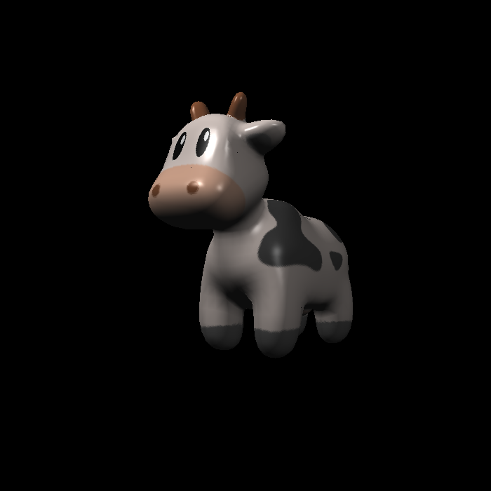
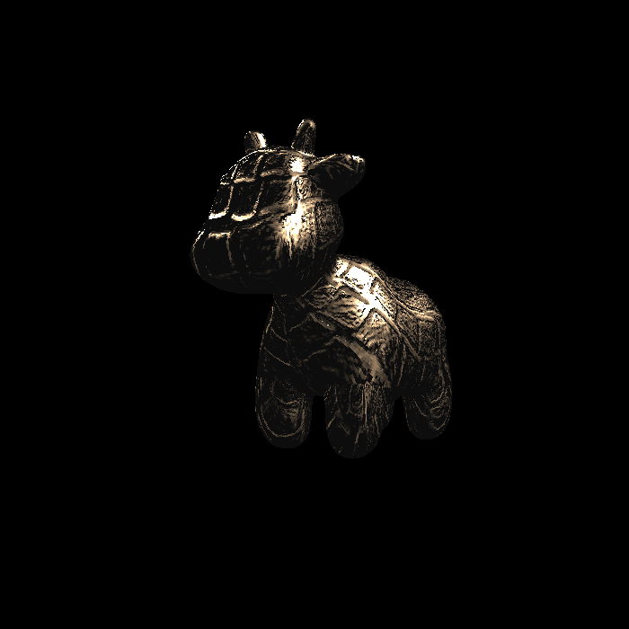
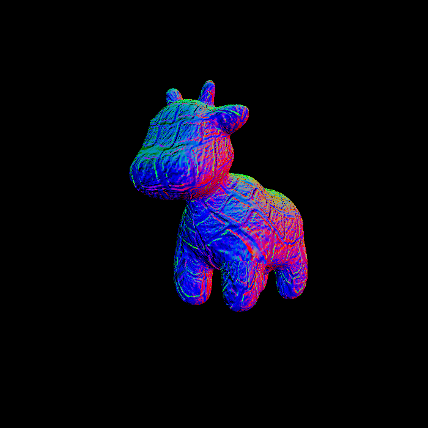
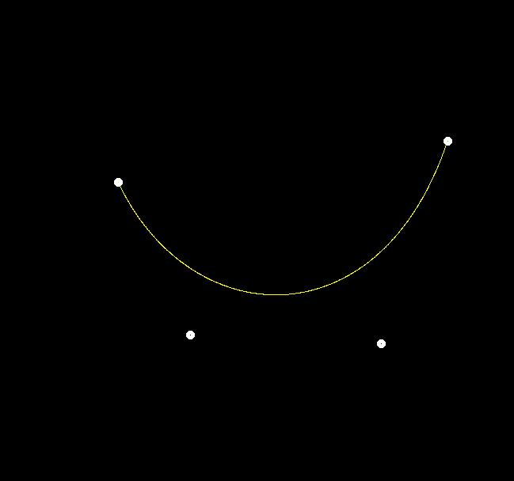
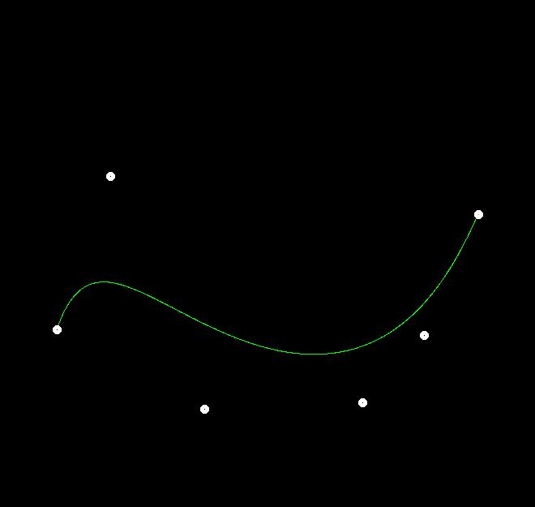
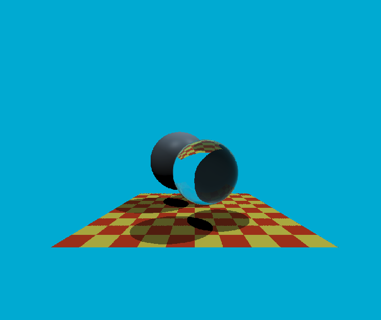

# Graphic-course-work
my impletion of GAMES101 graphic course work

---
### HW1:

### HW2

#### without MSAA

#### with MSAA

### HW3

#### normal 牛牛

#### texture牛牛

#### Blinn-Phong牛牛

#### Bump牛牛

#### Displacement牛牛

### HW4

#### Bezier Curve:

#### Bezier Curve with 6 points:

### HW5

#### Glass Ball on Blanket

### HW6

#### Rabbit(BVH)

